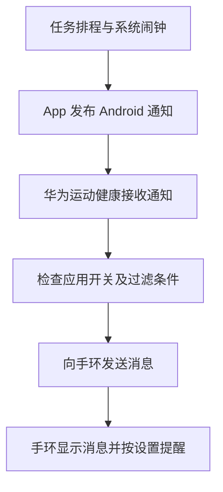

# 一次 Android 通知转发故障复盘

一款待办 App 到点发出任务通知，手机会响铃、会震动，通知栏也有完整内容。但手腕上的手环毫无反应，连消息列表里都找不到这条提醒。

同一台手机上的微信、QQ 邮箱却能正常提醒。更令人困惑的是，华为运动健康的应用通知列表里，这款待办 App 明明已经被勾选。

最初，我们怀疑通知格式不兼容，为此发布了一版兼容性调整。结果仍然无效。直到连接真机，读取到华为运动健康自己的过滤日志，才找到当次通知的直接阻断原因：**后台把这个应用的转发开关判定为关闭。**

重新进入消息通知设置并刷新对应应用开关后，新的任务提醒成功出现在手环上，并触发震动。最终恢复时，手机仍然使用原来的 2.3.2，没有再次构建或安装 APK。

这篇文章记录排查过程，也记录那些看上去合理、却没有被证据证实的猜测。

> 脱敏说明：自研应用统一称为“待办 App”，示例包名使用 `com.example.todo.debug`。日志经过筛选、裁剪和标识替换，不包含真实设备序列号、账号、业务内容、任务标识、服务地址和本机路径。保留设备型号及相关软件版本，用于说明复现环境。文中的日志片段来自本次实测，不代表厂商公开承诺的稳定接口。

## 先确定：通知在哪一段消失了

这次的设备组合是小米 14 Pro、华为手环 10，手机运行 HyperOS 3 / Android 16，配套应用为华为运动健康 17.0.8.300。

待办 App 的提醒流程是：先把任务排程同步到手机，再由 Android 系统闹钟到点触发，最后发布系统通知。

对这条经华为运动健康转发的链路，可以分成几个独立阶段：



华为官方的支持说明也描述了这一机制：运动健康与穿戴设备保持蓝牙连接时，会把手机通知栏产生的消息转发到设备。（参考资料 1）

因此，“服务器把消息推送给微信”和“本地闹钟让待办 App 发出通知”属于上游实现差异。对本次故障来说，手机已经产生通知，调查重点应该转向后面的接收、过滤和转发。

最有用的三个问题是：

| 需要确认的现象 | 能缩小到的排查范围 |
| --- | --- |
| 手机通知栏有没有具体任务通知？ | 如果没有，先查排程、闹钟、权限和通知发布 |
| 手环消息列表有没有这条消息？ | 如果有但不震动，重点查手环提醒模式；如果完全没有，继续查转发 |
| 手机锁屏时能否复现？ | 避免把“亮屏使用手机时不提醒”混入问题 |

这次的答案很明确：手机锁屏时会显示任务通知并响铃或震动，手环消息列表完全没有记录。

微信和邮件正常，是转发链路并未全面失效的线索，但它不能证明待办 App 也通过了自己的应用开关和过滤条件。

## 第一轮尝试：调整通知格式，结果没有解决

在没有真机日志的时候，我们先检查了应用代码，并做了一次兼容性尝试。

2.3.2 调整了以下内容：

- 将通知类别从 `CATEGORY_REMINDER` 改为 `CATEGORY_MESSAGE`。
- 补充 `tickerText` 摘要，保留标准标题、正文和展开文字。
- 移除任务通知的 `FLAG_ONLY_ALERT_ONCE`，继续用应用自身的提交记录去重。
- 从“固定数字 ID + 不同 tag”，改为“稳定的不同数字 ID + 完整 tag”。

这些改动是在验证兼容性假设。当时没有证据证明华为会过滤 `CATEGORY_REMINDER`，也没有证据证明它忽略通知的 tag。

原生测试和 Android 16 模拟器验证通过，说明修改后的通知能被系统发布、分别保留、正确去重和撤销。它们没有覆盖真实手机上的华为运动健康，更没有覆盖手环端的显示和震动。

用户安装后，故障依然存在。

这一轮最值得反思的是验证顺序：我们先修改了自己能控制的通知字段，之后才观察负责转发的组件。一次失败的兼容性试验可以缩小范围，但持续猜字段、改版本，不能替代对实际拒绝原因的读取。

## 接上真机后，先排除安装身份和监听状态

读取实际运行状态后，我们确认了几件事：手机安装的是预期版本和包名；应用通知权限已授予；华为运动健康的通知监听组件既被授权，也处于在线状态。

这里需要区分两种权限：待办 App 获准“发通知”，与运动健康获准“读取其他应用的通知”，分别属于通知链路的不同环节。Android 的 `NotificationListenerService` 就是通知监听服务的基础接口。（参考资料 2）

安装包身份也不能只看桌面上的应用名称。内部 Debug 包和正式包可能具有相同名称，却使用不同包名。排查时应把“哪个包正在发通知”和“转发设置对应哪个包”对上。本次真机核验没有发现装错包。

另一个细节是：**不要只查看配套应用主进程的日志。**

这次最初只检查了华为运动健康主进程，没有找到有用记录。继续定位服务后，才发现通知监听器运行在独立的 `:DaemonService` 进程中。切换到该进程的日志，过滤原因就出现了。

这个进程名属于本次观察到的版本实现，其他版本应重新确认，不能直接假定相同。

## 关键证据：消息已经收到，随后被应用开关拒绝

我们新建了一条未来触发的测试任务，锁屏等待，并要求触发后暂时保留手机通知。

华为监听进程的日志先记录了这条任务通知，随后明确拒绝转发。下面保留了有诊断价值的字段，包名、通道名和提醒标识均已替换：

```text
Start onNotificationPosted:
  pkg=com.example.todo.debug
  channel=task_reminders_v1
  id=<NOTIFICATION_ID>
  tag=<REMINDER_TAG>
  flags=AUTO_CANCEL
  category=msg

onNotificationPosted FILTERED because SUB_SWITCH_TURN_OFF,
pkg=com.example.todo.debug

com.example.todo.debug onNotificationPosted
isMeetPushConditions?(false=filtered): false
```

这组记录将当次失败定位到了很具体的位置：

1. 任务已触发，Android 已经产生通知。
2. 华为运动健康的监听器收到了这条通知。
3. 它以 `SUB_SWITCH_TURN_OFF` 为理由拒绝继续转发。

此时再调整上游的任务同步、闹钟调度，或者通知标题的写法，都没有命中已经观察到的阻断点。

但日志仍然没有解释全部问题。之后进入运动健康的消息通知页面检查时，待办 App 的开关显示为开启，与先前运行日志中的关闭判定不一致。

这里应把结论写得准确：**我们观察到了先前的后台关闭判定与随后界面开启状态之间的不一致。**这还不足以证明两者在同一瞬间一定不一致，也不能直接断言厂商存在某一种缓存、数据库或跨进程同步缺陷。

## 恢复过程：刷新配置，再验证新的提醒

实际操作很小：进入华为运动健康的设备消息通知页面，核对目标应用，把这一项关闭后重新开启，再确认界面状态。其他应用开关没有批量调整，也没有清空应用数据、重装配套应用或重置手环。

不过，复盘不能省略一个重要的时序细节：**在显式关闭再开启之前，重新进入设置的排查阶段就已经出现了后台放行记录。**

按事件先后整理，过程是这样的：

| 阶段 | 观察到的证据 |
| --- | --- |
| 首次测试任务触发 | 华为收到任务通知，以 `SUB_SWITCH_TURN_OFF` 拒绝 |
| 重新进入设置的排查阶段 | 后续通知开始通过应用开关检查；当时观察到的是常驻状态通知 |
| 检查界面 | 目标应用开关显示开启 |
| 显式刷新开关 | 只将目标应用关闭再开启，并核对状态 |
| 新建任务复测 | 任务通知通过检查，华为启动推送；手环显示消息并震动 |

因此，不能把这次经历简化成“关开一次必然修好”。目前能确认的是：进入并刷新这组配置后，运行态恢复了放行，新提醒完成了端到端验证。究竟是重新进入页面、其中的配置刷新，还是多个动作共同促成恢复，没有单变量实验能够继续区分。

复测时，华为日志从拒绝变成了以下记录：

```text
com.example.todo.debug onNotificationPosted
isMeetPushConditions?(false=filtered): true

onNotificationPosted startBroadcastToPhoneService method start!
onNotificationPosted reminderStatus is(15=0x000F=vibrate): 15
onNotificationPosted start to push notification msg
```

这里的 `15` 是本次厂商日志对振动状态的描述，不应被当成 Android 通用协议。日志中的“启动推送”也不能单独证明手环收到消息。

最后一环来自实际使用者的确认：**手环已显示消息，并且震动了。**至此，系统通知、配套应用放行、发送动作和手环结果才对上。

复测仍然使用 2.3.2。我们没有回退到之前的通知实现做对照，所以不能据此证明此前的兼容性改动“必不可少”，也不能证明它们“完全没有作用”。可以确认的是，本次恢复不需要继续改代码或再次发版。

## 两个容易把调查带偏的线索

### 系统生成的合组摘要，不等于真正的任务通知

真机上还能看到 Android 自动生成的通知摘要，其中带有 `LOCAL_ONLY`、`GROUP_SUMMARY` 等标记。只看这一条，很容易怀疑系统禁止了手环转发。

但这条摘要与应用真正发布的任务通知是不同的记录。Android 官方文档说明，系统可能自动合组，具体行为还会因设备而异。（参考资料 3）

在本次失败样本中，华为已经记录了带任务通道、具体提醒标识和 `AUTO_CANCEL` 标记的原始通知，并给出了应用开关关闭的拒绝理由。因此，不能把摘要上的 `LOCAL_ONLY` 直接认定为这次任务漏转的根因。

### 常驻状态通知被过滤，不等于任务仍然失败

待办 App 同时有两种通知：一种是任务到点提醒，另一种是后台同步服务的常驻状态通知。

配置恢复后，常驻通知仍然出现过这样的日志：

```text
isMeetPushConditions?(false=filtered): true
onNotificationPosted FILTERED because FLAG_NO_CLEAR,
pkg=com.example.todo.debug
```

它先通过应用开关检查，再因不可清除的常驻属性被过滤。在本次实现中，这与普通任务通知的处理结果不同。

如果只搜索包名，看到一条 `FILTERED` 就宣布“还没修好”，会把两种通知混在一起。需要结合通道、通知 ID、tag、触发时间和处理线程，确认每条日志究竟对应哪个事件。

同样，源码里配置了高重要性，也不能代替读取手机的实际通知通道设置。Android 通道创建后，用户能够修改其行为，应用重新创建同名通道不会把这些设置重置回源码中的默认值。（参考资料 4）

## 留下一套更短的排查路径

今后遇到“手机正常、手环无提示”，我会先按下面的顺序取证，再决定是否修改代码。

**第一步，固定一条测试消息。**使用无隐私的测试标题，设置未来的触发时间；记录是否锁屏，并分别检查手机通知、手环消息列表和震动。应用可能对已提交提醒做去重，刷新转发开关后应新建提醒，不要等待旧通知自动重放。

**第二步，核对实际安装包。**下面的命令假设电脑只连接了一台已授权调试的设备；示例包名需要替换为实际包名。

```bash
adb devices -l

TASK_PACKAGE='com.example.todo.debug'
adb shell pm list packages "$TASK_PACKAGE"
adb shell dumpsys package "$TASK_PACKAGE" |
  rg 'versionName=|versionCode=|User [0-9]|POST_NOTIFICATIONS'
```

**第三步，核对通知监听是否获准且在线。**启用名单和当前存活的服务要分别查看，不能只凭界面上的授权开关判断。

```bash
adb shell settings get secure enabled_notification_listeners

adb shell dumpsys notification |
  sed -n '/^  Notification listeners:/,/^  Notification assistant services:/p'
```

**第四步，定位真正处理通知的进程。**本次版本使用下面的进程名；如果查询不到，应先检查服务所属进程，不要继续用空 PID 抓日志。

```bash
HEALTH_LISTENER_PID="$(adb shell pidof 'com.huawei.health:DaemonService' | tr -d '\r')"

if [ -n "$HEALTH_LISTENER_PID" ]; then
  adb logcat -d --pid="$HEALTH_LISTENER_PID" -v threadtime |
    rg 'com\.example\.todo\.debug'
fi
```

按包名筛选可以快速找到接收和拒绝记录，但不包含包名的后续发送日志也可能被筛掉。找到测试通知后，还应结合相邻时间与线程继续追踪。不能因为一次关键词搜索没有结果，就断定某个步骤没有执行；并非所有厂商或版本都会输出同样的诊断日志。

**第五步，依据实际拒绝理由做最小修正。**如果明确拒绝于目标应用的转发开关，就核对并刷新这一项；如果拒绝于其他条件，继续沿对应分支查。不要同时重装应用、清空数据、重置蓝牙和修改通知代码，否则即使恢复，也很难知道哪个动作起了作用。

**第六步，用新通知完成验证。**“应用调用成功”“系统里有通知”“华为开始推送”和“手环实际提醒”是四种不同的结果。记录时应分别命名，不能都写成“发送成功”。

排查命令的原始输出可能包含设备标识、其他应用名称和通知内容。公开复盘时，只保留与测试事件有关的字段，用一致的示例包名和占位符替换可识别信息。本篇也没有附上全量系统日志或第三方应用程序文件。

## 这次经验会如何改变后续开发

首先，通知诊断需要覆盖应用之外的接收方。我们自己的“已提交系统通知”状态是有用的，但它证明不了手环收到；界面上的勾选也证明不了当时运行中的过滤逻辑已经放行。应尽早把下一跳实际接收到什么、为什么拒绝，纳入排查。

其次，开发者容易优先修改自己熟悉的部分。本次借助 AI 阅读代码、比对通知字段、整理日志，都能提高效率；但在没有真机证据的时候，把一个合理猜测迅速变成新版本，也可能让排查走得更远。让工具先找出具体拒绝点，通常比让它再猜一组兼容性参数更有价值。

最后，修复记录应保留结论的边界。这次已经解决了连接设备上的问题，也确认了失败样本被应用开关拒绝。配置状态为什么出现差异、是否会在其他版本复现、旧通知实现是否同样能恢复，都没有完成验证。把这些问题留在记录里，后续再次遇到类似现象时，才不会把一次成功经验误用成普遍规则。

这次最有价值的产物，是一段能说明通知在哪里被拒绝的日志，以及一条经过实际手环确认的成功提醒。有了这两端的证据，修复才有明确的起点和终点。

## 参考资料

以下官方资料用于解释系统机制和常规检查项；本文关于具体失败原因与恢复结果的结论，来自本次真机日志和实际验收。

1. 华为官方：华为手表／手环连接华为或安卓手机后，收不到消息怎么办？

   ```text
   https://consumer.huawei.com/cn/support/content/zh-cn15958978/
   ```

2. Android Developers：NotificationListenerService。

   ```text
   https://developer.android.com/reference/android/service/notification/NotificationListenerService
   ```

3. Android Developers：Create a group of notifications。

   ```text
   https://developer.android.com/develop/ui/views/notifications/group
   ```

4. Android Developers：Create and manage notification channels。

   ```text
   https://developer.android.com/develop/ui/compose/notifications/channels
   ```


<!-- publisher-release:b470672f-6ec9-443d-a563-ef774e6745ca -->
