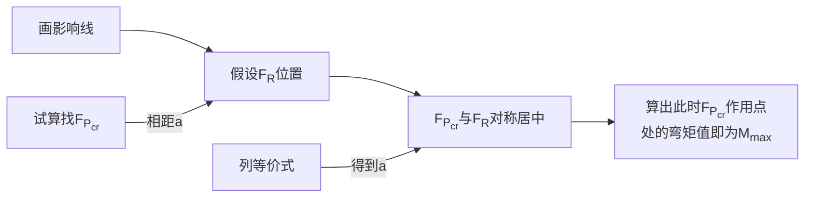

# 第八章 影响线  
## 1 基本概念  

### 1.1 影响线的概念  

- 定义：是表示**单位移动荷载**作用下某一量值（即某确定截面的内力、反力或位移) 变化规律的图形。**它在某点的竖标表示单位荷载作用于该点时，量值的大小**;  
- 绘制范围：从荷载移动的起点画至终点，荷载不经过处，不绘制影响线;  
- 竖标的量纲：反力、轴力、剪力——无量纲，**弯矩——长度（m）**。  
- 正负号规定：支座反力以向上为正，轴力以拉力为正，剪力以使隔离体有顺时针旋转的趋势为正，弯矩以使梁下侧受拉为正。**正影响线纵坐标绘在基线上方，负的绘制在基线下方**（竖杆都可以），**并标注“+”和“-”号**。（必须要标）  
- 影响线的形状：
	- **静定结构**的**内力**(或反力）影响线是**直线或折线**;
	- **静定结构**的**位移**影响线是**曲线**;
	- **超静定结构**的**内力和位移**影响线都是**曲线**。  

### 1.2 影响线与内力图的区别  

- ①作图范围不同。内力图的作图范围是整个结构，其基线就表示该结构; 而影响线的作图范围是荷载移动的范围，其基线表示的是单位荷载的移动路线，荷载不经过处，不绘制影响线。  
- ②截面不同。内力图表示的是当外荷载不动时, 各个截面的内力值; 而影响线表示的是当外荷载移动时, 某指定截面的内力图。  
- ③量纲不同。**影响线的量纲是相应内力图的量纲除以 kN **。  

## 2 绘制影响线  

### 2.1 静力法

- 万能方法，难题在这里出，适用桁架结构和刚架结构
- 方法：当绘制静定结构影响线时，只需要**找出关键结点的影响线数值，然后直接连直线就可以快速求出**  
- **悬臂梁**的绘制方法是在**基本结构的基础上直接延伸图线**即可  
- ①建立坐标系：选取坐标原点，以 FP=1 的移动方向为 x 轴 (x 轴的指向可以任意假设)，以与 FP=1 指向相反的方向作为 y 轴正方向建立坐标系。
- ②假设所求某量值的方向 (剪力、轴力应按正方向假设，弯矩和支座反力按题目给定的正方向假设，如果题目未给定，则可以任意假设)，建立静力平衡方程，将该量值表示为 x 的函数。  
- ③根据函数关系, 绘出该量值的影响线。  
	- 若影响线是正值，则绘于 y 轴正向; 反之，绘于 y 轴负向。  
	- 影响线正负的含义: 若影响线为正值，表示实际的量值与假设方向相同，若为负值则与假设方向相反。因此，量值的不同假设方向，可能求出的影响线符号恰恰相反，但都可以是正确结果。  
- 重要结论: 单位移动力偶作用下某量的影响线也就等于单位竖向移动荷载下该量影响线的斜率。  

### 2.2 机动法

- 适用于梁体，间接荷载
- 方法：**撤去该处对应的约束**，并使之发生**正向单位位移**，结构的变形图即为该量值的影响线。（**求什么释放什么**）
- 注意点
	- 定向支座和定向结点连接的两侧杆件应始终保持平行  
	- 对一些位移图不易判断的带有斜杆的结构（如一些桁架），最好还是用静力法

### 2.3 联合法  

- 机动法确定图形特征，静力法确定竖标
- 特别注意: 在用机动法将所求轴力的杆件切断，代以原轴力后，原静定结构的某一结间会形成机构，**其余部分仍要是内部几何不变**(刚片)，才能用联合法。 ——切完杆件之后画刚片 

### 2.4 间接荷载作用下的影响线绘制方法  

- 根据静定结构的内力 (或反力) 影响线是直线或折线这一性质绘制间接荷载作用下某量值的影响线，可以通过修正直接荷载作用下相应量值影响线的方法来得到。具体做法是:  
	- ①先作**直接荷载作用下的影响线**(可用静力法, 也可以用机动法)  
	- ②将各结点向影响线做**投影点**。  
	- ②用**直线连接**相邻投影点的竖距，就得到了间接荷载作用下的影响线。  
- 影响线的绘制范围是从**荷载**移动的起点画至终点

### 2.5 刚架影响线  

- 先通过机动法判断变形标出关键结点——再利用静力法求解绘图  
- 机动法判断技巧  
	- 做题的时候先用机动法判断变形，判断完之后要恢复原结构的状态  
	- 如果部分构件是一个刚片（连在一起没有铰），那么其上面的影响线就必然是一条直线  

### 2.6 桁架影响线  

- **断杆画刚片➠机动法找形➠静力法求值**
- 区分上承与下承  
	- 上承就是荷载作用在上弦杆，下承就是荷载作用在下弦杆  
	- 这两种情况影响线可能相同也可能不同  
- 求解技巧  
	- 转化为支座力，通过支座影响线求其中的杆件影响线  
	- 桁架所求的杆件的两端一定是关键结点  
	- 以所求杆件为分界线，荷载作用在一侧取另一侧的隔离体来进行分析  

### 2.7 位移影响线  

- 位移影响线是表示在单位移动荷载下某截面位移变化规律的图线，其某处竖标的含义是：单位力移至该处时所求截面的位移。位移影响线是曲线。通常利用位移互等原理来绘制位移影响线的形状，求位移影响线就是求结构变形的挠曲线。  

## 3 影响线的应用  

### 3.1 影响线计算量值  

- 如果荷载整好作用在影响线的跳跃处，应该分左右进行计算。
- 题目说最大值但是没表明正负的时候一律按照最大绝对值处理！

### 3.2 求荷载最不利位置与绝对最大弯矩值

- FPcr：临界荷载（其作用位置可得影响线最大值，采用试算法最好）
- FR：所有荷载的合力
- 注意等价式的列法（旋转效应）

## 4 超静定结构的影响线  

- 一般是曲线——考小题——只是让画出大致形状（用机动法）——注意画出递减的趋势（向远端传递）  