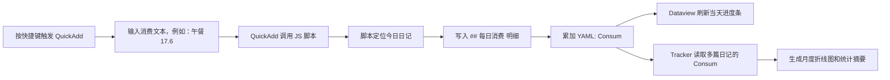

# Obsidian 记账系统原理与应用场景

这套记账系统把“随手记录消费”和“自动汇总分析”拆成了几层：QuickAdd 负责快捷输入，JavaScript 脚本负责写入日记和累加 YAML，Dataview 负责在日记里即时展示当天进度，Tracker 负责跨日记读取 `Consum` 字段并生成月度折线图与统计摘要。

核心思路是：每一天的日记既是明细账，也是当天消费总额的数据源。明细写在 `## 每日消费` 标题下，汇总金额写在 YAML frontmatter 的 `Consum` 字段里。这样既保留了人能直接阅读的消费列表，也给 Dataview 和 Tracker 留出了稳定、可计算的数据入口。

## 数据结构

每篇日记的 YAML 中有一个 `Consum` 字段，用来保存当天消费总额：

```yaml
---
Consum: 37.20
---
```

每条消费明细写在日记正文的 `## 每日消费` 标题下，格式固定为：

```markdown
- [S] 午餐 17.60 元 #日记/消费
- [S] 晚餐 19.60 元 #日记/消费
```

这里有两个数据层级：

- `Consum` 是机器读取的总额，适合 Dataview 和 Tracker 统计。
- `- [S] ... #日记/消费` 是人阅读的明细，适合回顾当天钱花在哪里。

## 插件分工

### QuickAdd：快捷入口

QuickAdd 提供快捷键或命令入口。触发后，它调用 `001-javascript/script/QuickAddConsum.js`，脚本弹出输入框，输入格式可以是：

```text
可口可乐 3
午餐 17.6
晚餐 19.60 元
```

脚本会从输入内容中识别最后一个金额，把前面的文本当作消费描述。这样输入速度比较快，不需要分别填“项目”和“金额”两个字段。

### JavaScript：写入和累加

`QuickAddConsum.js` 负责实际的数据更新：

1. 定位当天日记：`002-project/003-日记/YYYY-MM-DD.md`
2. 解析输入文本，得到消费描述和金额。
3. 把消费明细插入到 `## 每日消费` 区域。
4. 读取 YAML 中已有的 `Consum`。
5. 将本次金额累加进去，并保留两位小数。
6. 弹出提示，告诉你本次记录和今日累计金额。

例如输入：

```text
可口可乐 3
```

会写入：

```markdown
- [S] 可口可乐 3.00 元 #日记/消费
```

同时把 YAML 从：

```yaml
Consum: 34.20
```

更新为：

```yaml
Consum: 37.20
```

### Dataview：当天进度展示

每个日记模板中都有 `## 每日消费` 的 Dataview 代码块，用来把 `Consum` 渲染成当天消费进度条：

````
```dataview
list without id
"<div style='display: flex; justify-content: space-between; align-items: center; margin-bottom: -5px;'>" +
"<span>💸 消费 <span style='color: var(--text-muted);'>📉 " + regexreplace(currencyformat(round((Consum/50)*100, 2), "CNY"), "[^0-9.-]", "") + "%</span></span>" +
"<span style='display: flex;'>" +
    "<span style='width: 100px;'>💰 " + regexreplace(currencyformat(round(Consum, 2), "CNY"), "[^0-9.-]", "") + " 元</span>" +
    "<span style='width: 100px; color: var(--text-muted);'>🔴 " + regexreplace(currencyformat(round(50 - Consum, 2), "CNY"), "[^0-9.-]", "") + " 元</span>" +
"</span>" +
"</div>" +
"<progress value='" + Consum + "' max='50' style='width: 100%;'></progress>"
where file.path = this.file.path
```
````

这里的 `50` 是每日预算上限。Dataview 会读取当前日记的 `Consum`，展示：

- 当前消费占预算的百分比
- 已消费金额
- 剩余金额
- HTML 进度条

为了让整数也显示成两位小数，模板中使用了：

````
```dataview
regexreplace(currencyformat(round(Consum, 2), "CNY"), "[^0-9.-]", "")
```
````

它的作用是先把数字按人民币格式转成固定两位小数，再去掉货币符号，只保留数字文本。因此 `16` 会显示为 `16.00`，`16.5` 会显示为 `16.50`。

### Tracker：月度趋势分析

Tracker 不读取正文里的消费明细，而是读取每篇日记 YAML 中的 `Consum` 字段。图表笔记中的消费折线图配置大致如下：

````
```tracker
searchType: frontmatter
searchTarget: Consum
folder: 002-project/003-日记
startDate: 2026-06-01
endDate:
line:
    title: "月消费额度折线图"
    xAxisLabel: 日期
    yAxisLabel: 额度
    xAxisTickLabelFormat: D号
    lineColor: grey
```
````

这段配置表示：

- 从 `002-project/003-日记` 文件夹中读取日记。
- 在每篇日记的 frontmatter 中查找 `Consum`。
- 按日期生成月消费折线图。
- 横轴显示日期，纵轴显示消费额度。

同一篇图表笔记中还可以使用 Tracker 的 `summary` 统计：

```tracker
searchType: frontmatter
searchTarget: Consum
folder: 002-project/003-日记
startDate: 2026-06-01
endDate:
summary:
    template: "总共：{{sum()}} 元；平均每天：{{average()}} 元\n最低：{{min()}} 元；最高：{{max()}} 元\n"
```

这样就能看到本月总消费、日均消费、最低值和最高值。

## 完整流程



这条链路的关键点是：`Consum` 是整个系统的中枢字段。QuickAdd 脚本负责写它，Dataview 负责显示它，Tracker 负责跨文件分析它。

## 应用场景

### 1. 每日消费预算控制

在日记中直接看到当天已经花了多少钱、还剩多少钱。适合设置一个固定日预算，例如 50 元或 100 元。消费越接近上限，进度条越明显，能在当天及时提醒自己收手。

### 2. 食堂和日常小额开销记录

系统适合记录高频、小额、容易遗忘的消费，例如早餐、午餐、晚餐、饮料、打印、快递、水果等。输入只需要一行文本，比打开专门记账 App 更轻。

### 3. 月度复盘

Tracker 可以把每天的 `Consum` 连成折线图。通过折线图可以快速看到哪几天花得异常多，哪几天控制得比较好，也可以配合 summary 看总额、平均值、最高值和最低值。

### 4. 和日记复盘结合

消费明细放在日记正文里，旁边通常也有当天的时间线和任务记录。月底复盘时，不只能看到“花了多少钱”，还可以回到当天日记，看当时为什么花了这笔钱。

### 5. 低成本扩展个人量化数据

这套模式不只适合消费，也可以扩展到体重、学习时间、运动时间、睡眠时间等字段。只要遵循同样结构：把当天总量写进 YAML，再用 Dataview 做当日展示，用 Tracker 做跨日趋势分析，就能形成一套统一的个人数据面板。

## 维护和扩展建议

- 如果要修改每日预算，优先修改 7 个日记模板中 `Consum/50`、`50 - Consum` 和 `<progress max='50'>` 里的 `50`。
- 如果某天预算不同，可以在当天日记里单独改成 `50`，例如 `2026-06-04.md` 中的消费进度就是按 50 元预算展示。
- 如果 Tracker 图表不显示，先检查日记 YAML 中是否有 `Consum`，再检查 `folder` 是否指向 `002-project/003-日记`。
- 如果 QuickAdd 没有写入，检查当天日记是否已经创建，并确认日记里存在 `## 每日消费` 标题。
- 如果想做分类统计，可以在消费描述中固定写关键词，例如 `早餐`、`午餐`、`晚餐`、`饮料`，以后再用 Dataview 或 DataviewJS 按标签/关键词聚合。

## 当前系统的优点

- 输入轻：快捷键触发，一行文本完成记录。
- 数据稳：总额落在 YAML 的 `Consum` 字段中，方便插件读取。
- 明细清楚：每条消费都保留在日记正文里。
- 展示即时：Dataview 直接在当天日记里显示进度。
- 趋势清晰：Tracker 可以生成月度折线图和统计摘要。
- 可迁移：所有数据都是 Markdown 和 YAML，不依赖封闭数据库。
